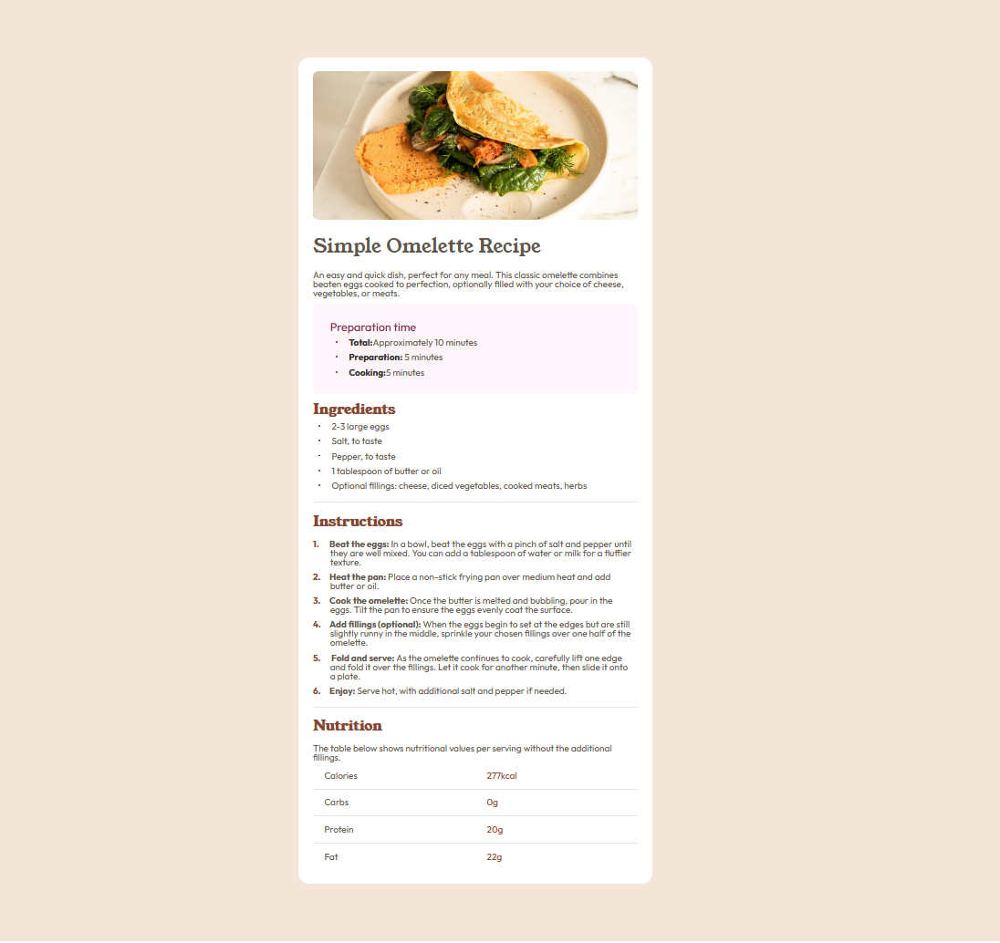

# Frontend Mentor - Recipe page solution

This is a solution to the [Recipe page challenge on Frontend Mentor](https://www.frontendmentor.io/challenges/recipe-page-KiTsR8QQKm). Frontend Mentor challenges help you improve your coding skills by building realistic projects. 

## Table of contents

- [Overview](#overview)

  - [Screenshot](#screenshot)
  - [Links](#links)

  - [Built with](#built-with)
  - [What I learned](#what-i-learned)

  - [Useful resources](#useful-resources)
- [Author](#author)

## Overview

In this challenge task was to copy style of a recipe card

### Screenshot

### Links

- Solution URL: https://github.com/LisFoxG/Recipe_page
- Live Site URL: https://lisfoxg.github.io/Recipe_page/

### Built with

- Media querie
- Flexbox
- CSS Grid

### What I learned

I learned to use flexbox and grid to complete various tasks

### Useful resources

- https://developer.mozilla.org/en-US/- This helped me to find some useful properties.

## Author

- Frontend Mentor - [@LisFoxG](https://www.frontendmentor.io/profile/LisFoxG)

